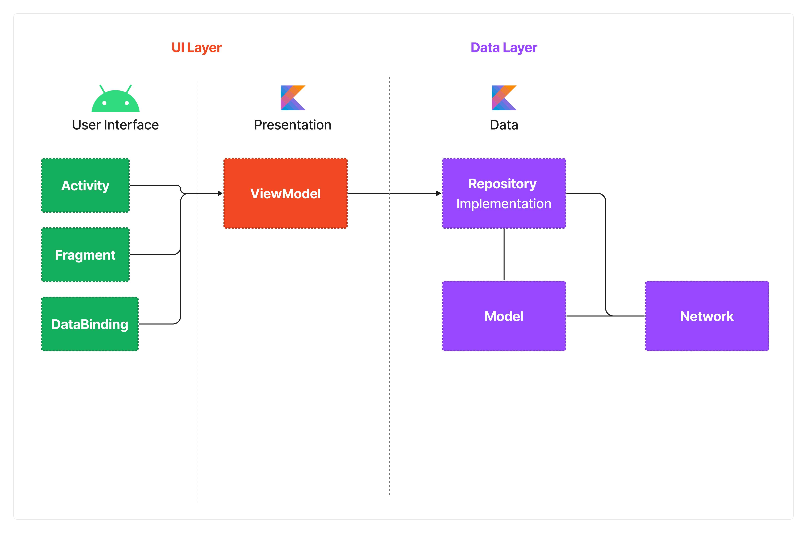

# Switfy

Swifty is a service-matching application that demonstrates modern Android development with Coroutines, Retrofit, Firebase,and Jetpack (ViewModel) based on the MVVM architecture.

## Features

- Client/Agent mode toggle
- Mission creation and matching
- Subscription and notification
- User profile and evaluation
- Instant chat
- Wallet and transactions

## Tech stack & Open-source libraries
- Minimum SDK level 21
- [Kotlin](https://kotlinlang.org/) based, [Coroutines](https://github.com/Kotlin/kotlinx.coroutines) for asynchronous.
- Jetpack
  - Lifecycle: Observes Android lifecycles and handles UI states upon lifecycle changes.
  - ViewModel: Manages UI-related data holders and is lifecycle-aware. Allows data to survive configuration changes such as screen rotations.
  - DataBinding: Binds UI components in your layouts to data sources in your app using a declarative format rather than programmatically.
- Architecture
  - MVVM Architecture (View - DataBinding - ViewModel - Model)
  - Repository Pattern
- [Retrofit2](https://github.com/square/retrofit): communicate with the REST APIs and paging network data.
- [Glide](https://github.com/bumptech/glide): Loading images from network.
- [WorkManager](https://developer.android.com/topic/libraries/architecture/workmanager): WorkManager is the primary recommended API for background processing.
- [LocationManager](https://developer.android.com/reference/android/location/LocationManager): LocationManager for precise location tracking and building location-aware applications.

## Architecture

The overall architecture of **Swifty** is composed of two layers; the UI layer and the data layer. Each layer has dedicated components and they have each different responsibilities, as defined below:

**Swifty** was built with [Guide to app architecture](https://developer.android.com/topic/architecture), so it would be a great sample to show how the architecture works in real-world projects.

## License

[MIT](https://choosealicense.com/licenses/mit/)

